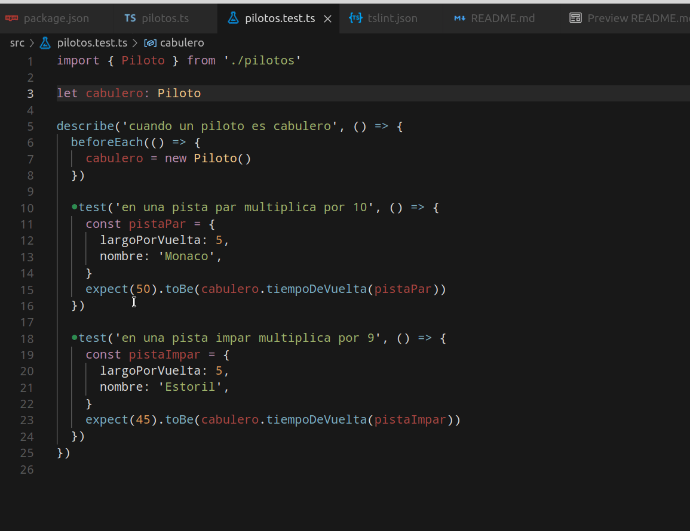

# Clase práctica - intro a Typescript desde PDP

## Inicialización del proyecto

Si querés arrancar el proyecto desde cero, tenés que instalar Node, NPM, crearte una carpeta y seguí estos pasos

```bash
npm init
npm i -g typescript
npm i --save-dev typescript
npm i -g ts-node
npm i jest @types/jest ts-jest -D
```

Algunos archivos recomendamos copiarlos de este proyecto:

- `tsconfig.json`: contiene la configuración para transpilar typescript a javascript
- `tslint.json`: las reglas que queremos aplicar para "compilar" un archivo typescript
- `.gitignore`: qué archivos no nos interesa subir a git

## El enunciado: Rápidos y Objetosos

Vamos a trabajar con el [enunciado de uno de los TP](https://docs.google.com/document/d/1m4zWUbiUPI-Ck_Kx9QXLWM9xSq425fpAhXgV6WHQjpc/edit#), en particular nos interesa trabajar el tiempo que tarda un piloto en completar una vuelta. Esto depende de la estrategia que tenga: los cabuleros multiplican por 9 ó 10 el largo de la vuelta, dependiendo de si el nombre es par. Ya con eso podemos pensar en nuestras clases de equivalencia:

- un piloto cabulero corre en una pista de nombre par, supongamos que tiene un largo de 5 kms => debería tardar 50 segundos
- un piloto cabulero corre en una pista de nombre impar, supongamos que tiene un largo de 5 kms => debería tardar 45 segundos

## Primera versión: trabajando con clases y objetos

Creamos entonces una clase Piloto en typescript:

```ts
export class Piloto {
  private formaConducir = cabulero

  public tiempoDeVuelta(pista: Pista) {
    return this.formaConducir.tiempoDeVuelta(this, pista)
  }
}
```

Typescript 

- tiene anotaciones de tipos, por eso el método tiempoDeVuelta debe indicar que recibe una pista, de tipo Pista. 
- pero también trabaja con inferencia de tipos, por eso el atributo formaConducir no necesita anotarse con ningún tipo, por el momento será de tipo cabulero (que veremos a continuación).

El método tiene el modificador `public` para indicar que es visible por cualquier otro objeto, mientras que la estrategia es un atributo `private`, lo que implica que no podremos obtener su referencia directamente:

```ts
// es válido
const piloto = new Piloto()
piloto.tiempoDeVuelta(...)
// no es válido
piloto.formaConducir...
```

Veamos cómo se implementa la estrategia: una clase, y luego un objeto instancia de Cabulero, que se exportará como definición hacia afuera (en Typescript es necesario indicar qué definiciones queremos que se puedan importar desde otro archivo):

```ts
class Cabulero {
  public tiempoDeVuelta(piloto: Piloto, pista: Pista) {
    return pista.largoPorVuelta * this.efectoMultiplicador(pista)
  }

  public efectoMultiplicador(pista: Pista) {
    const pistaNombrePar = pista.nombre.length % 2 === 0
    return pistaNombrePar ? MULTIPLICADOR_PAR : MULTIPLICADOR_IMPAR
  }
}

export const cabulero = new Cabulero()
```

La Pista es casi una estructura más que una clase, no tiene por el momento comportamiento:

```ts
export class Pista {
  public nombre: string = ''
  public largoPorVuelta = 0
}
```

## Incorporando los tests

El framework de testeo unitario que utilizaremos es JEST, y dentro de VSC tenemos un plugin que se adapta bastante bien:

```ts
import { Piloto } from './pilotos'

let cabulero: Piloto

describe('cuando un piloto es cabulero', () => {
  beforeEach(() => {
    cabulero = new Piloto()
  })

  test('en una pista par multiplica por 10', () => {
    const pistaPar = {
      largoPorVuelta: 5,
      nombre: 'Monaco',
    }
    expect(50).toBe(cabulero.tiempoDeVuelta(pistaPar))
  })

  test('en una pista impar multiplica por 9', () => {
    const pistaImpar = {
      largoPorVuelta: 5,
      nombre: 'Estoril',
    }
    expect(45).toBe(cabulero.tiempoDeVuelta(pistaImpar))
  })
})
```

- importamos las definición de Piloto del archivo correspondiente
- un describe agrupará un conjunto de tests, al igual que en Wollok
- podemos definir dentro de un describe variables `let` o `const`
- y dentro del bloque `beforeEach` ejecutamos un conjunto de instrucciones antes de cada test (al igual que el fixture de Wollok)
- como la pista no tiene comportamiento, es fácilmente reemplazable por un objeto plano de javascript (también llamado JSON), que no es otra cosa que un mapa/diccionario de claves/valores. Fíjense que podemos enviar un mensaje al piloto pasándole un objeto que cumple la misma interfaz, que es tener atributos **públicos** nombre y largoPorVuelta
- en lugar de asserts trabajamos con expectativas, que tiene patrones de trabajo muy similares (qué espero vs. qué obtengo)



Esta versión la podrás encontrar en la carpeta `version01`.

## Refactor de Pista

Si vemos nuevamente la definición de Pista y la implementación de la clase Cabulero, podríamos delegar un poco más:

```ts
export class Pista {
  public nombre: string = ''
  public largoPorVuelta = 0
}

...

class Cabulero {
  public tiempoDeVuelta(piloto: Piloto, pista: Pista) {
    return pista.largoPorVuelta * this.efectoMultiplicador(pista)
  }
```

Creamos entonces un método nombrePar() en Pista:

```ts

```

## Segunda y tercera estrategia

## Interfaces o union types

## Funciones

