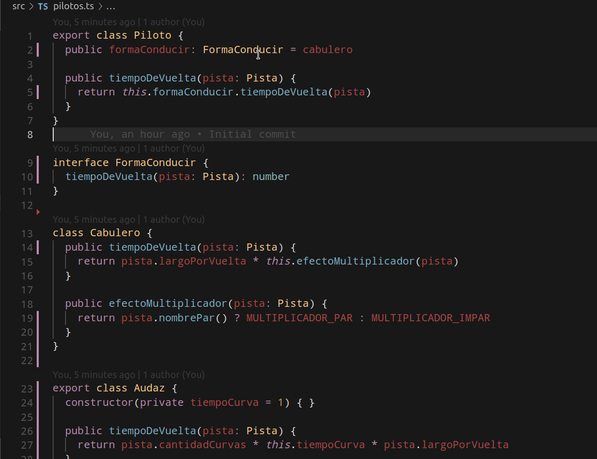

# Clase práctica - intro a Typescript, yendo de OO a Funcional

[](https://github.com/uqbar-project/eg-rapidos-y-objetosos-ts/actions/workflows/build.yml)  

## El enunciado: Rápidos y Objetosos

Estamos modelando una aplicación para pilotos de carreras, y nos interesa resolver el tiempo que tarda un piloto en completar una vuelta. Esto depende de la estrategia que tenga: en primera instancia tendremos a los **cabuleros**, que tardan el largo de la vuelta de la pista (medido en kilómetros) * 10 ó 9, dependiendo de que el nombre de la pista tenga una cantidad par o impar de letras, respectivamente.

Ya podemos pensar en base a ello nuestras clases de equivalencia:

- un piloto cabulero corre en una pista de nombre par, supongamos que tiene un largo de 5 kms => debería tardar 50 segundos
- un piloto cabulero corre en una pista de nombre impar, supongamos que tiene un largo de 5 kms => debería tardar 45 segundos

## Primera versión: trabajando con clases y objetos

Creamos entonces una clase Piloto en typescript:

```ts
export class Piloto {
  private formaConducir = cabulero

  public tiempoDeVuelta(pista: Pista) {
    return this.formaConducir.tiempoDeVuelta(pista)
  }
}
```

Typescript 

- tiene anotaciones de tipos, por eso el método tiempoDeVuelta debe indicar que recibe una pista, de tipo Pista. 
- pero también trabaja con inferencia de tipos, por eso el atributo formaConducir no necesita anotarse con ningún tipo, por el momento será de tipo cabulero (que veremos a continuación).
- `export class Piloto` permite que el archivo publique la clase. Desde otro archivo podemos hacer el [import](https://www.typescriptlang.org/docs/handbook/modules.html) correspondiente

El método tiene el modificador `public` para indicar que es visible por cualquier otro objeto, mientras que la estrategia es un atributo `private`, lo que implica que no podremos obtener su referencia directamente:

```ts
const piloto = new Piloto()

// es válido
piloto.tiempoDeVuelta(...)

// no es válido
piloto.formaConducir...
```

Por defecto [la visibilidad de los métodos es pública](https://www.typescriptlang.org/docs/handbook/2/classes.html#member-visibility), así que podemos escribir de ahora en más:

```ts
export class Piloto {
  private formaConducir = cabulero

  tiempoDeVuelta(pista: Pista) {
    return this.formaConducir.tiempoDeVuelta(pista)
  }
}
```

Veamos cómo se implementa la estrategia: una clase, y luego un objeto instancia de Cabulero:

```ts
class Cabulero {
  tiempoDeVuelta(pista: Pista) {
    return pista.largoPorVuelta * this.efectoMultiplicador(pista)
  }

  efectoMultiplicador(pista: Pista) {
    const pistaNombrePar = pista.nombre.length % 2 === 0
    return pistaNombrePar ? MULTIPLICADOR_PAR : MULTIPLICADOR_IMPAR
  }
}

export const cabulero = new Cabulero()
```

El cabulero es un **Singleton**, una referencia pública accesible con solo escribir:

```ts
import { cabulero } from 'pilotos'
```

La Pista es casi una estructura más que una clase, no tiene por el momento comportamiento:

```ts
export class Pista {
  public nombre: string = ''
  public largoPorVuelta = 0
}
```

## Incorporando los tests

El framework de testeo unitario que utilizaremos es JEST, y dentro de VSC tenemos un [plugin](https://marketplace.visualstudio.com/items?itemName=Orta.vscode-jest) que se adapta bastante bien:

```ts
import { Piloto } from './pilotos'

let cabulero: Piloto

describe('cuando un piloto es cabulero', () => {
  beforeEach(() => {
    cabulero = new Piloto()
  })

  test('en una pista par multiplica por 10', () => {
    const pistaPar = {
      largoPorVuelta: 5,
      nombre: 'Monaco',
    }
    expect(50).toBe(cabulero.tiempoDeVuelta(pistaPar))
  })

  test('en una pista impar multiplica por 9', () => {
    const pistaImpar = {
      largoPorVuelta: 5,
      nombre: 'Estoril',
    }
    expect(45).toBe(cabulero.tiempoDeVuelta(pistaImpar))
  })
})
```

- importamos las definición de Piloto del archivo correspondiente
- un describe agrupará un conjunto de tests, al igual que en Wollok
- el formato `(elemento) => { return elemento }` describe un _closure_ que recibe un parámetro y ejecuta el código que está entre llaves. Hay otros _syntactic sugars_ pero nos quedamos con éste por ahora.
- podemos definir dentro de un describe variables `let` (referencias que pueden cambiar) o `const` (referencias que no pueden apuntarse a ningún otro valor)
- y dentro del bloque `beforeEach` ejecutamos un conjunto de instrucciones antes de cada test (al igual que el fixture de Wollok)
- como la pista no tiene comportamiento, es fácilmente reemplazable por un objeto plano de javascript (también llamado JSON), que no es otra cosa que un mapa/diccionario de claves/valores. Fíjense que podemos enviar un mensaje al piloto pasándole un objeto que cumple la misma interfaz, que es tener atributos **públicos** nombre y largoPorVuelta
- en lugar de asserts trabajamos con expectativas, que tiene patrones de trabajo muy similares (qué espero vs. qué obtengo)


Esta versión la podrás encontrar en la carpeta `version01`.

## Refactor de Pista

Si vemos nuevamente la definición de Pista y la implementación de la clase Cabulero, podríamos delegar un poco más:

```ts
export class Pista {
  public nombre: string = ''
  public largoPorVuelta = 0
}

...

class Cabulero {
  tiempoDeVuelta(pista: Pista) {
    return pista.largoPorVuelta * this.efectoMultiplicador(pista)
  }
```

Creamos entonces un método nombrePar() en Pista:

```ts
nombrePar() {
  return this.nombre.length % 2 === 0
}
```

Eso permite que el Cabulero ya no tenga la responsabilidad de determinar si la pista tiene un nombre par:

```ts
efectoMultiplicador(pista: Pista) {
  return pista.nombrePar() ? MULTIPLICADOR_PAR : MULTIPLICADOR_IMPAR
}
```

Pero nos rompieron los tests, porque estamos usando un objeto puro JSON que no entiende el mensaje `nombrePar()`:


Efectivamente, tenemos que solucionarlo creando objetos Pista. Pero en lugar de crearlos en forma incómoda, asignando las referencias una a una

```ts
const pistaPar = new Pista()
pistaPar.largoPorVuelta = 5
pistaPar.nombre = 'Monaco'
```

vamos a pasarle parámetros al constructor:

```ts
const pistaPar = new Pista('Monaco', 5)
```

Y lo definimos de esta manera: 

```ts
constructor(public nombre = '', public largoPorVuelta = 0) { }
```

- ventaja 1: la inicialización se hace en un solo paso y el objeto queda consistente
- ventaja 2: Typescript permite agregar el modificador `public`, `protected` o `private` en el parámetro de un constructor y genera un atributo automáticamente (no hace falta definirlo ni hacer `this.nombre = nombre` por lo que mucha burocracia se elimina). También es posible definirle valores por defecto, con lo que sigue siendo válido `new Pista()` a secas, o `new Pista("Le Mans")`.
- la desventaja: cuando tenés muchos parámetros puede ser un dolor de cabeza, y **no se puede definir más de un constructor en Typescript**

Fíjense cómo quedan los tests:

```ts
let cabulero: Piloto

describe('cuando un piloto es cabulero', () => {
  beforeEach(() => {
    cabulero = new Piloto()
  })

  test('en una pista par multiplica por 10', () => {
    const pistaPar = new Pista('Monaco', 5)
    expect(50).toBe(cabulero.tiempoDeVuelta(pistaPar))
  })

  test('en una pista impar multiplica por 9', () => {
    const pistaImpar = new Pista('Estoril', 5)
    expect(45).toBe(cabulero.tiempoDeVuelta(pistaImpar))
  })
})
```

Mucho más cortos en su definición, y funcionando perfectamente.

Esta variante la podés encontrar en la carpeta `version02`.

## Audaces y virtuosos

Ahora agregaremos nuevas formas de conducción para los pilotos:

- los **audaces** definen el tiempo como el tiempo por curva (específico para cada uno) * cantidad de curvas de la pista * largo por vuelta.
- los **virtuosos**  tienen un nivel de virtuosismo distinto para cada uno pero que puede variar. El tiempo se calcula como el largo por vuelta * 30 / el nivel de virtuosismo. 

Creamos las definiciones de audaces y virtuosos, que no pueden exportarse como simples objetos **singleton** ya que debemos configurar la información correspondiente a cada caso (pueden coexistir dos pilotos audaces con diferente tiempo por curva, o dos pilotos virtuosos con distinto nivel de virtuosismo).

```ts
export class Audaz {
  constructor(private tiempoCurva = 1) { }

  tiempoDeVuelta(pista: Pista) {
    return pista.cantidadCurvas * this.tiempoCurva * pista.largoPorVuelta
  }
}

export const VALOR_BASE_VIRTUOSISMO = 30

export class Virtuoso {
  constructor(private nivelVirtuosismo = 1) { }

  tiempoDeVuelta(pista: Pista) {
    return pista.largoPorVuelta * (VALOR_BASE_VIRTUOSISMO / this.nivelVirtuosismo)
  }
}
```

Y los tests correspondientes,

- una clase de equivalencia para un audaz
- otra para un virtuoso, evitaremos utilizar el nivel de virtuosismo = 0 que sería un caso borde

Para ello, necesitamos acceder al atributo `formaConducir`, por lo que vamos a optar por la opción más sencilla: definirlo como `public`. Hacemos algunos cambios adicionales, como tener tres referencias internas dentro de cada describe, y llamarlas mejor:

```ts
describe('piloto cabulero', () => {
  let pilotoCabulero: Piloto

  beforeEach(() => {
    pilotoCabulero = new Piloto()
  })

  test('en una pista par multiplica por 10', () => {
    const pistaPar = new Pista('Monaco', 5)
    expect(50).toBe(pilotoCabulero.tiempoDeVuelta(pistaPar))
  })

  test('en una pista impar multiplica por 9', () => {
    const pistaImpar = new Pista('Estoril', 5)
    expect(45).toBe(pilotoCabulero.tiempoDeVuelta(pistaImpar))
  })
})
```

Pero cuando llegamos a nuestro segundo describe, nos aparece un error de tipos:


Esto ocurre porque nosotros no anotamos la forma de conducir del piloto, sino que le dimos el valor por defecto cabulero, entonces le asigna el tipo cabulero.

### Union types

La primera forma de resolverlo es tener **union types**, es decir, la unión de los tipos posibles:


```ts
public formaConducir: Cabulero | Audaz | Virtuoso = cabulero
```

Esto implica que cuando necesitemos agregar al seguidor, habrá que incorporarlo a esta definición taxativa de tipos.

### Interface

Otra variante podría ser trabajar con una interfaz. En la clase Pilota definimos la anotación de tipo para la forma de conducir:

```ts
public formaConducir: FormaConducir = cabulero
```

La FormaConducir define una interfaz, la cáscara que debe ser implementada por los objetos a los que va a apuntar dicha referencia:

```ts
interface FormaConducir {
  tiempoDeVuelta(pista: Pista): number
}
```

Lo interesante, no hay que hacer nada más: cualquier clase u objeto que tenga una definición `tiempoDeVuelta(pista: Pista)` que devuelva un número puede calzar perfectamente en esta definición:



Typescript trabaja con **tipado estructural**, ya que cualquier estructura que tenga un método tiempoDeVuelta que reciba una pista y devuelva un número será considerada válida para las reglas de su sistema de tipos. Esto también se conoce como [**duck typing**](https://stackoverflow.com/questions/4205130/what-is-duck-typing):

- si camina como pato
- y hace cuac como un pato

entonces debe ser un pato.

> Si tiene el método `tiempoDeVuelta(pista: Pista): number` debe ser un `FormaConducir` válido.

Incluso podríamos haber definido un objeto, con un método, al estilo Wollok:

```ts
describe('piloto con una forma de conducir especial', () => {
  let pilotoAudaz: Piloto
  let pista: Pista

  beforeEach(() => {
    pilotoAudaz = new Piloto()
    pilotoAudaz.formaConducir = {
      tiempoDeVuelta(unaPista: Pista) {
        return unaPista.nombre.length * 10
      }
    }
    pista = new Pista('Estoril')
  })

  test('el tiempo de vuelta utiliza la regla definida en la forma de conducir especial', () => {
    expect(70).toBe(pilotoAudaz.tiempoDeVuelta(pista))
  })
})
```

No es necesario asociar el objeto ni ninguna clase a la interfaz definida, como deberíamos hacerlo en otros lenguajes (ej. Java).

La variante de esta versión la podés encontrar en la carpeta `version03`.

## Funciones

Y dejamos para el final la posibilidad de construir las estrategias como funciones polimórficas, en todas entra una pista y en todas sale un número.

Iniciamos el juego con el cabulero, que no mantiene estado y por lo tanto es la variante más sencilla

```ts
export const cabulero = (pista: Pista): number => {
  return pista.largoPorVuelta * efectoMultiplicador(pista)
}
```

El efecto multiplicador es simplemente una función auxiliar (sigue habiendo acoplamiento entre las funciones solo que no tenemos un agrupador):

```ts
function efectoMultiplicador(pista: Pista): number {
  return pista.nombrePar() ? MULTIPLICADOR_PAR : MULTIPLICADOR_IMPAR
}
```

También podemos definir el efectoMultiplicador como una expresión lambda directamente:

```ts
const efectoMultiplicador = (pista: Pista) => {
  return pista.nombrePar() ? MULTIPLICADOR_PAR : MULTIPLICADOR_IMPAR
}
```

Ah sí, typescript es híbrido y permite definir funciones.

Otro _syntactic sugar_ que trae TS es que podemos omitir el return si la definición de nuestra función es de una sola línea y devuelve un valor:

```ts
export const cabulero = (pista: Pista): number => pista.largoPorVuelta * efectoMultiplicador(pista)

const efectoMultiplicador = (pista: Pista): number => pista.nombrePar() ? MULTIPLICADOR_PAR : MULTIPLICADOR_IMPAR
```

Nuestro consejo es que vayas familiarizándote de a poco con el lenguaje y sus variantes.

En el caso del audaz, recordemos la técnica de aumentar lo que una función conoce a partir de los parámetros, que aumentan el scope de cosas conocidas. Entonces para construir una estrategia audaz, necesitamos pasarle el tiempo de curva, y eso nos va a devolver la función que puede calcular el tiempo de vuelta:

```ts
export const audaz = (tiempoCurva = 1) => {
  return (pista: Pista) => {
    return pista.cantidadCurvas * tiempoCurva * pista.largoPorVuelta
  }
}
```

De manera similar funciona el virtuoso: 

```ts
export const virtuoso = (nivelVirtuosismo = 1) => {
  return (pista: Pista) => {
    return pista.largoPorVuelta * (VALOR_BASE / nivelVirtuosismo)
  }
}
```

Lo que cambia el piloto es poco:

```ts
export class Piloto {
  formaConducir: (pista: Pista) => number = cabulero // defino valor default

  tiempoDeVuelta(pista: Pista) {
    return this.formaConducir(pista)   // la aplico
  }
```

Aquí vemos que la forma de conducir se tipa a una función explícitamente. Y la forma de evaluar una función es pasándole parámetros con los paréntesis:

```ts
f    // es una función
f()  // se aplica sin parámetros
f(1) // se aplica con un parámetro
```

Y el test tampoco cambia mucho:

```ts
describe('piloto audaz', () => {
  let pilotoAudaz: Piloto
  let pista: Pista

  beforeEach(() => {
    pilotoAudaz = new Piloto()
    // el único cambio es llamando a la función audaz que devuelve otra función
    pilotoAudaz.formaConducir = audaz(3)
    //
    pista = new Pista('Estoril', 5, 5)
  })

  test('en una pista común', () => {
    expect(75).toBe(pilotoAudaz.tiempoDeVuelta(pista))
  })
})
```

Cambiamos el import de la clase `Audaz` por la función `audaz`. Y eso es todo.

## Para pensar

Cuánto de lo que vimos se pareció a lo que viste en la cursada de Wollok, en un lenguaje (Typescript) que es comercial. Cómo una misma solución puede encararse de varias maneras diferentes y cómo los paradigmas están en la cabeza de quien los programa.
